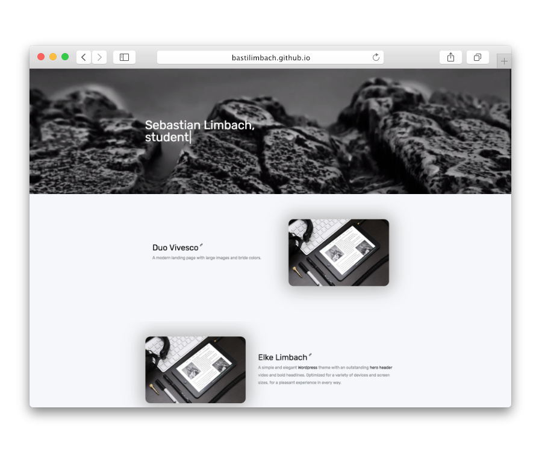

# sebastianlimbach.com

    

This site is build using [Jekyll](https://jekyllrb.com/) and maintained by [Sebastian Limbach](https://github.com/bastilimbach).

## Directory structure
| Folder | Content |
| --- | --- |
| _posts | All posts on the home page. |
| _drafts | All drafts, which aren't published. |
| _includes | Contains some included html files like `header` & `footer` |
| _layouts | Contains all page types like `default` or `post`. |
| assets | Folder containing fonts, images and potential other assets. |
| css | Contains the `main.sass` file which includes all .sass files from the `_sass` directory. |
| scripts | Contains some javascript vendors. |

If you want to dig deeper into the directory structure of a jekyll app, consider taking a look at [the docs.](https://jekyllrb.com/docs/structure/)

## Developing
To get this site running locally, you need to install [ruby](https://www.ruby-lang.org/en/documentation/installation/), [jekyll](https://jekyllrb.com/docs/quickstart/) and [node.js](https://nodejs.org/). After a successful installation, follow these steps below:

- Clone the source code using `git clone https://github.com/bastilimbach/bastilimbach.github.io`.
- Install all the ruby dependencies by running `bundle install`.
- Install all the javascript dependencies by running `npm install`.
- Start the server for local testing with `npm start`.
- Happy coding! :+1:

## Contribution
If you find a typo or some other bug, Pull Requests are very welcome!
> Important: Before you push your changes, run `npm run build`.

## License
This website is happy to be a part of the open source movement, so it of course uses the license we all love. [MIT License](/LICENSE) :heart:
